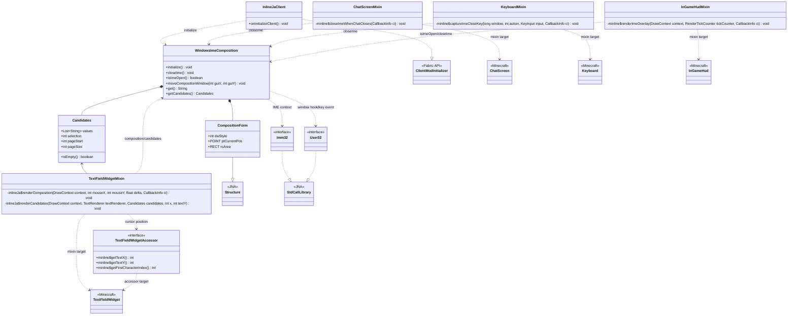

# クラス図

```mermaid
classDiagram
    class InlineJaClient {
        +onInitializeClient() void
    }

    class WindowsImeComposition {
        +initialize() void
        +closeIme() void
        +isImeOpen() boolean
        +moveCompositionWindow(int guiX, int guiY) void
        +get() String
        +getCandidates() Candidates
    }

    class Candidates {
        +List~String~ values
        +int selection
        +int pageStart
        +int pageSize
        +isEmpty() boolean
    }

    class CompositionForm {
        +int dwStyle
        +POINT ptCurrentPos
        +RECT rcArea
    }

    class Imm32 {
        <<interface>>
    }

    class User32 {
        <<interface>>
    }

    class TextFieldWidgetMixin {
        -inlineJa$renderComposition(DrawContext context, int mouseX, int mouseY, float delta, CallbackInfo ci) void
        -inlineJa$renderCandidates(DrawContext context, TextRenderer textRenderer, Candidates candidates, int x, int textY) void
    }

    class TextFieldWidgetAccessor {
        <<interface>>
        +minline$getTextX() int
        +minline$getTextY() int
        +minline$getFirstCharacterIndex() int
    }

    class ChatScreenMixin {
        -minline$closeImeWhenChatCloses(CallbackInfo ci) void
    }

    class KeyboardMixin {
        -minline$captureImeCloseKey(long window, int action, KeyInput input, CallbackInfo ci) void
    }

    class InGameHudMixin {
        -minline$renderImeOverlay(DrawContext context, RenderTickCounter tickCounter, CallbackInfo ci) void
    }

    class ClientModInitializer {
        <<Fabric API>>
    }

    class TextFieldWidget {
        <<Minecraft>>
    }

    class ChatScreen {
        <<Minecraft>>
    }

    class Keyboard {
        <<Minecraft>>
    }

    class InGameHud {
        <<Minecraft>>
    }

    class Structure {
        <<JNA>>
    }

    class StdCallLibrary {
        <<JNA>>
    }

    InlineJaClient ..|> ClientModInitializer
    InlineJaClient ..> WindowsImeComposition : initialize

    WindowsImeComposition *-- Candidates
    WindowsImeComposition *-- CompositionForm
    WindowsImeComposition ..> Imm32 : IME context
    WindowsImeComposition ..> User32 : window hook/key event

    Candidates <-- TextFieldWidgetMixin
    TextFieldWidgetMixin ..> WindowsImeComposition : composition/candidates
    TextFieldWidgetMixin ..> TextFieldWidgetAccessor : cursor position
    TextFieldWidgetMixin ..> TextFieldWidget : mixin target

    TextFieldWidgetAccessor ..> TextFieldWidget : accessor target
    ChatScreenMixin ..> WindowsImeComposition : closeIme
    ChatScreenMixin ..> ChatScreen : mixin target
    KeyboardMixin ..> WindowsImeComposition : closeIme
    KeyboardMixin ..> Keyboard : mixin target
    InGameHudMixin ..> WindowsImeComposition : isImeOpen/closeIme
    InGameHudMixin ..> InGameHud : mixin target

    CompositionForm --|> Structure
    Imm32 ..|> StdCallLibrary
    User32 ..|> StdCallLibrary
```
